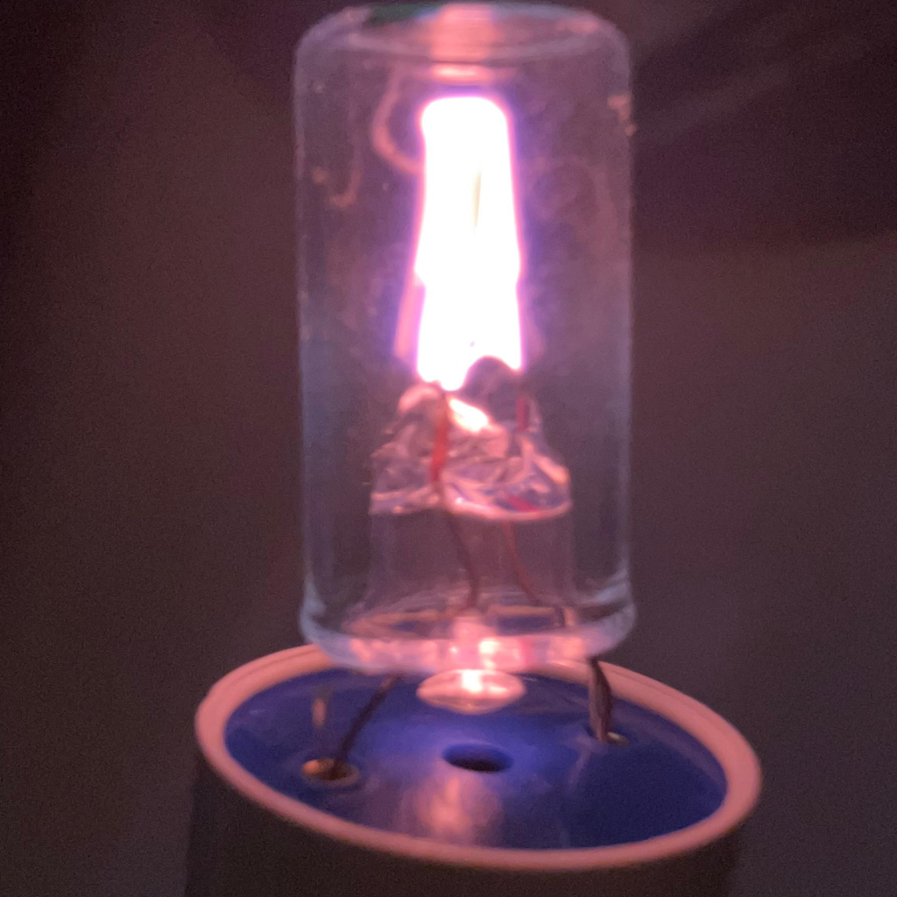

# SpectralSim

SpectralSim ist eine interaktive Web-Simulation eines Gitterspektrometers.  
Die Anwendung visualisiert kontinuierliche und diskrete Spektren, berechnet Beugungswinkel und zeigt die spektrale Verteilung sowohl als Diagramm als auch als Spektrometerbild.



## Funktionen

- Simulation von Weißlicht als thermischem Strahler.
- Emissionsspektren typischer Gasentladungslampen.
- Berechnung der Beugung am optischen Gitter.
- Einfluss von Gitterlinienzahl, Beugungsordnung und Spaltbreite.
- 1D-Spektrum, 2D-Bild und Linienausgabe in einer Oberfläche.
- Modalfenster mit Hilfetext und physikalischen Erklärungen.

## Physikalische Grundlage

Die zentrale Beziehung der Simulation ist die Gittergleichung:

\[
n \lambda = d \sin(\theta)
\]

Dabei ist \(n\) die Beugungsordnung, \(\lambda\) die Wellenlänge, \(d\) der Gitterabstand und \(\theta\) der Beugungswinkel.  
Je größer die Linienzahl des Gitters, desto kleiner wird \(d\) und desto stärker wird das Licht aufgefächert [file:1][file:3].

Weißlicht wird als thermische Strahlung angenähert und über das Plancksche Strahlungsgesetz modelliert.  
Gasentladungslampen werden über charakteristische Emissionslinien beschrieben, etwa für Wasserstoff, Helium, Neon, Natrium, Quecksilber und Leuchtstofflampen [file:1].

## Installation

Die Anwendung ist eine reine Web-App und benötigt keinen Build-Prozess.

1. Repository herunterladen oder klonen.
2. `index.html` im Browser öffnen.
3. Optional einen lokalen Webserver nutzen, falls der Browser das direkte Öffnen lokaler Dateien einschränkt.

Beispiel mit Python:

```bash
python -m http.server 8000
```

Danach die Anwendung unter `http://localhost:8000` öffnen.

## Verwendung

Über das Bedienfeld kannst du folgende Parameter ändern:

- **Quelle**: Wahl der Lichtquelle.
- **Gitterlinien/mm**: bestimmt den Gitterabstand.
- **Beugungsordnung**: setzt die Ordnung \(n\).
- **Spaltbreite**: beeinflusst die Linienbreite.
- **Farbtemperatur Weißlicht**: verändert die thermische Verteilung.

Die Ausgabe aktualisiert sich direkt im Browser und zeigt das resultierende Spektrum sowie die berechneten Linien [file:3].

## Projektstruktur

```text
.
├── index.html
├── app.js
├── style.css
└── README.md
```

- `index.html`: Benutzeroberfläche und Einbindung der Bibliotheken.
- `app.js`: Physikmodell, Berechnung und Rendering.
- `style.css`: Layout, Farben, Panels und Modalfenster.
- `README.md`: Projektbeschreibung und Dokumentation [file:1][file:2][file:3].

## Physikalische Einordnung

Die Simulation trennt die wichtigsten Schritte der Spektroskopie:

1. Die Lichtquelle erzeugt ein Spektrum.
2. Das Beugungsgitter lenkt Wellenlängen winkelabhängig ab.
3. Der Eintrittsspalt begrenzt die Auflösung.
4. Die Darstellung wandelt Wellenlängen in Farben und Pixelpositionen um.

Dadurch wird sichtbar, warum reale Spektren nicht nur von der Lichtquelle, sondern auch stark vom Instrument abhängen [file:1].

## Grenzen

Die Simulation ist didaktisch und vereinfacht.  
Sie bildet keine vollständige Laboroptik ab, sondern konzentriert sich auf die wichtigsten Zusammenhänge der klassischen Spektroskopie.  
Effekte wie Detektorrauschen, Aberrationen, Polarisation oder genaue Kalibrierung sind nicht Teil des Modells [file:1].

## Lizenz


```text
© 2026 SpectralSim. Alle Rechte vorbehalten.
```


